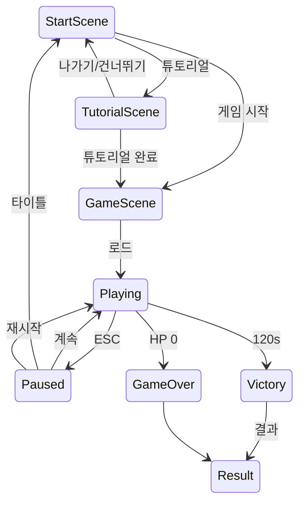

# Beat Defender — 화면 · 씬 · 흐름

> **연관:** [PLAN.md](./PLAN.md) · [DEV.md](./DEV.md) · [MAP.md](./MAP.md)  
> **문서 동기화:** [PLAN.md §0](./PLAN.md#0-문서-체계--동기화-규칙)

---

## 1. 씬 구성 (3개)

| 씬 | 파일 | 역할 |
|----|------|------|
| **StartScene** | `StartScene.unity` | 타이틀 · 게임 · **튜토리얼** |
| **GameScene** | `GameScene.unity` | **2분** 본편 · Pause · 결과 |
| **TutorialScene** | `TutorialScene.unity` | 단계별 가이드 · 리듬 연습 |

---

## 2. 화면 상태

---

## 3. StartScene

| UI | 동작 |
|----|------|
| **게임 시작** | → GameScene |
| **튜토리얼** | → TutorialScene |
| **종료** | Quit |

---

## 4. GameScene — Playing

- **2:00** 카운트다운 HUD
- 타워 종류 선택 HUD → 슬롯 클릭 설치
- 타워 클릭 → 판매 버튼

---

## 5. Pause (ESC)

| 정지 | 유지 |
|------|------|
| 적·타워·스폰·Core·게임 타이머 | **BeatClock** · **메트로놈** · **Rail 펄스** |

- `Time.timeScale = 0`
- BeatClock → **`Time.unscaledDeltaTime`**
- Rhythm bus 볼륨 **40%** ([BALANCE.md §8](./BALANCE.md))

### Pause 패널

계속 · 재시작 · 설정 · 시작 화면

---

## 6. TutorialScene

### StartScene에서

- 단독 로드 · **나가기/건너뛰기** → StartScene
- **완료** → GameScene

### 내용

- 10단계 순차 가이드 (리듬 → 패턴 → 타워 → 승리 조건)
- Rail + Scroll · CD 비활성 · 적 없음
- 상세: [TUTORIAL.md](./TUTORIAL.md)

---

## 7. Settings

마스터 · SFX · Rhythm(메트로놈) · 시작 화면

---

## 8. 결과 화면

| Victory (2:00) | Game Over |
|----------------|-----------|
| `CLEAR — {점} ({등급})` | `GAME OVER — {점} (D)` |
| HP · 처치 · PERFECT/GOOD/MISS | 생존 시간 · breakdown |

→ [BALANCE.md §10](./BALANCE.md)

---

## 9. 구현 우선순위

| 순위 | 항목 |
|------|------|
| P0 | GameScene 120s · Pause · BeatClock unscaled |
| P1 | PracticeScene (Start) · 타워 3종·판매 |
| P1 | Pause Additive Practice |
| P2 | StartScene · 결과+점수 |

---

## 10. 수정 이력

| 날짜 | 변경 |
|------|------|
| 2026-07-03 | Start/Game, Pause, 결과 |
| 2026-07-03 | **2분**, **PracticeScene**, Pause BeatClock 40% |
